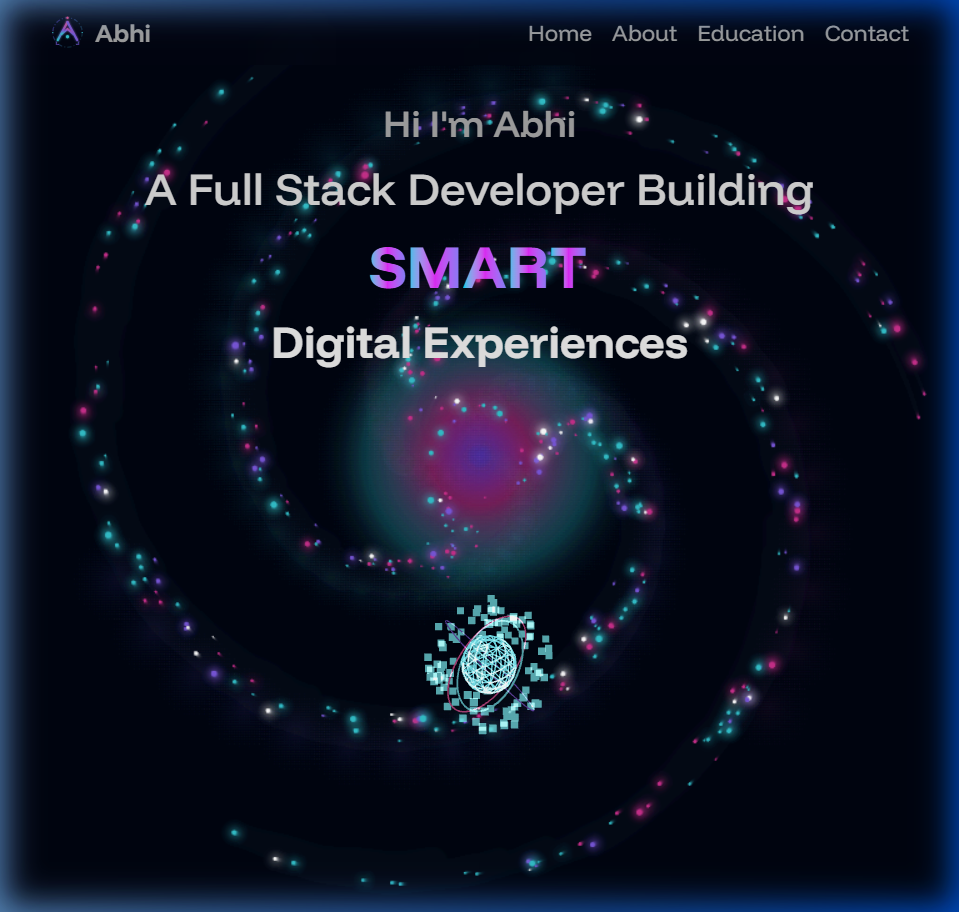

# Abhi Raj | Personal Portfolio

A modern, interactive, and fully responsive personal portfolio website designed to showcase my skills in Full-Stack Web Development, Cyber Forensics, and Video Editing. 

Built with an immersive dark cosmic theme, featuring 3D interactive background elements, animated bento-grid layouts, and seamless smooth scrolling.



## 🚀 Features

- **Modern UI/UX**: Immersive dark theme with a dynamic, floating particle background and rotating 3D globe visualization.
- **Bento Grid Layout**: Sleek card-based grid layout in the About section for a clean and structured presentation of skills.
- **Smooth Animations**: Powered by Framer Motion for elegant scroll-triggered fades, scaling, and layout animations.
- **Fully Functional Contact Form**: Built-in contact form that forwards messages directly to email using the FormSubmit API (no backend required).
- **Responsive Design**: Carefully optimized to look stunning on mobile phones, tablets, and desktop displays.

## 🛠️ Tech Stack

- **Framework**: React.js & Vite
- **Styling**: Tailwind CSS & Vanilla CSS
- **Animations**: Framer Motion (motion/react)
- **Deployment**: Firebase Hosting
- **Icons**: Devicon, SimpleIcons, and native Emojis

## 💻 Getting Started

To run this project locally, follow these steps:

1. **Clone the repository:**
   ```bash
   git clone https://github.com/YOUR_GITHUB_USERNAME/portfolio-website.git
   cd portfolio-website
   ```

2. **Install dependencies:**
   ```bash
   npm install
   ```

3. **Start the development server:**
   ```bash
   npm run dev
   ```

4. Open your browser and navigate to `http://localhost:5173`.

## 📬 Contact

Have a project in mind or want to collaborate? Feel free to reach out through the contact form on the website!
